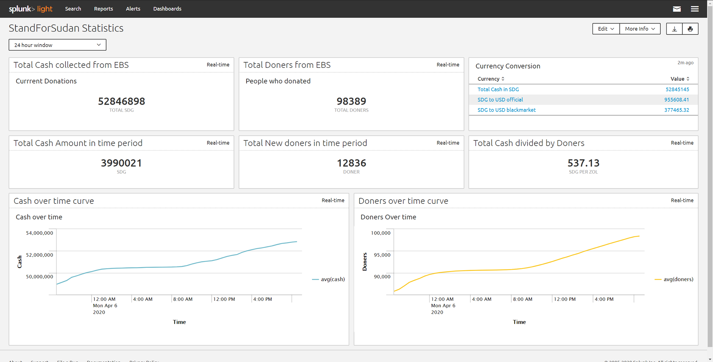

# SFS
StandForSudan historic data for graphs

quickly written scripts to grap data from ebs website to do analysis on the data

## Description
the script when ran will send a request to SFS endpoint to grap numbers
then saves these in json, csv files and printing to terminal

## Content of the repo
1. python script (grabber.py)
2. json file (StandForSudan_DATA.json)
3. csv file (StandForSudan_DATA.csv)
4. terminal log file (log.txt)

## How to run
I recommend running the script in a linux environment however it should work on windows if you install missing libraries

1. create a cron job to run the script every 1 hour

```
crontab -e
*/1 * * * * python3 grabber.py >> ~/log.txt
```

2. you can watch data from the files by cat-ing them in a watch command

```
watch -n 3600 'cat ~/log.txt'
watch -n 3600 'cat ~/StandForSudan.json'
watch -n 3600 'cat ~/StandForSudan.csv'
```
3. putting it all in a background session using tmux because i like it...

```
tmux new -s SFS
watch -n 3600 'cat ~/log.txt'

```


My current setup is like this:

Ubuntu VM running the script and posting the results to a shared folder on the host machine

Windows VM running Splunk light that monitors changes to files in the shared folder and reflects the changes in real time


## if you want to help
If you can help create visualizations and graphs from the data please do it and send me a message on twitter jaw33sh and will add it here along with your name
please create an issue or a pull request

### how to write an issue
1. go to issues tab and create a new issue
2. include any relevant information i need to replicate your issue
3. describe the issue as you would for a 10 year old


## Credits
friends and folks who helped on the code:
1. anonymous
2. anonymous
3. anonymous
4. anonymous


## Graphs and illustrations
because one picture speaks a 1000 words

*when the curve is flat that means no new people donated any cash*

*Times are GMT+4 unless stated otherwise*

Making sense of the data example one 4-april-2020 - using splunk free:


30 minute Window 5-april-2020:

the jump on the left graph represent huge bigger than previous amount of cash donated


5/april/2020 11:30 pm
Close to 1 Million USD collected - 900K USD


5/april/2020
955k USD collected
from 7am to 7pm Khartoum time there was 2000000 donations


2,292,676‬ SDG from 7am to 7pm Khartoum time


7,509 new people from 7am to 7pm Khartoum time


6/April/2020 9pm Khartoum time

Crossed 100k Doners


7/april/2020 7:37 pm Khartoum time<br>
**DONATIONS CROSSED 1 MILLION USD**<br>
Cash Count:<br>
57657142 / 55.3 = 1,042,624.62 Million USD
<br>
Doners Count<br>
109340 - 109329 = 11 Sudani Zol


